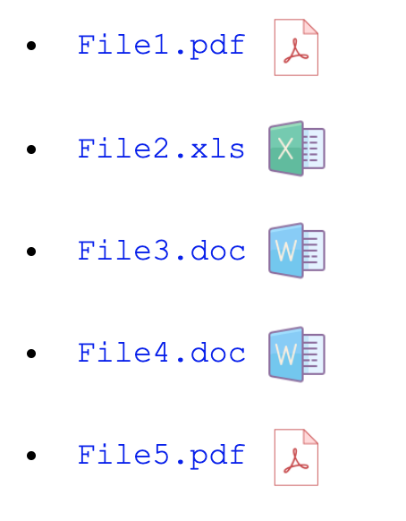

# Pseudo Element Style

### Part 1

- Generate an unordered list of lorem ipsum quotes using emmet

- Apply pseudo elements to place a quote icon before and after each quote

- Use this link for the source image - https://s3-us-west-2.amazonaws.com/s.cdpn.io/161359/quotes.png

#### Mockup

### Part 2

Using pseudo elements, replicate the file link list shown below.

- After each file name in the link list we want to display the corresponding file type as an icon
  - Include the following file types in the link list: `.pdf`,`.xls`, `.doc` 

- Use attribute selectors to select files by type and then use a pseudo element to place the matching file type icon after each list entry

#### Icons

> **PDF** - https://img.icons8.com/officel/64/000000/pdf.png
>
> **XLS** - https://img.icons8.com/dusk/64/000000/ms-excel.png
>
> **DOC** - https://img.icons8.com/dusk/64/000000/ms-word.png

### Part 3

Using pseudo elements `::before` and `::after`, create the 'sandwich div' shown below.

- These borders are not REAL borders - make the pseudo elements block level elements with width and height and give them a linear gradient as background

- The top and bottom gradients should alternate in direction

[//]: # (autograding info start)
#  Results
> ⌛ Give it a minute. As long as you see the orange dot  on top, CodeBuddy is still processing. Refresh this page to see it's current status.
>
> This is what CodeBuddy found when running your code. It is to show you what you have achieved and to give you hints on how to complete the exercise.

### Part 1 - Quotes

|                 Status                  | Check                                                                                    |
| :-------------------------------------: | :--------------------------------------------------------------------------------------- |
|  | List elemets have `:before` pseudo element |
|  | List elemets have `:after` pseudo element |
|  | Pseudo elements use 'quotes' image |

### Part 2 - Files

|                 Status                  | Check                                                                                    |
| :-------------------------------------: | :--------------------------------------------------------------------------------------- |
|  | Files list should include link to a PDF file |
|  | Files list should include link to an XLS file |
|  | Files list should include link to a DOC file |
|  | Link elemets have `:after` pseudo element |
|  | Pseudo elements use icon images |

### Part 3 - Gradient

|                 Status                  | Check                                                                                    |
| :-------------------------------------: | :--------------------------------------------------------------------------------------- |
|  | Sandwich section should be styled using linear gradients |

[🔬 Results Details](../../actions)
[🐞 Tips on Debugging](https://github.com/DCI-EdTech/autograding-setup/wiki/How-to-work-with-CodeBuddy)
[📢 Report Problem](https://docs.google.com/forms/d/e/1FAIpQLSfS8wPh6bCMTLF2wmjiE5_UhPiOEnubEwwPLN_M8zTCjx5qbg/viewform?usp=pp_url&entry.652569746=UIB-UI-UX-pseudo-element-style)

[//]: # (autograding info end)