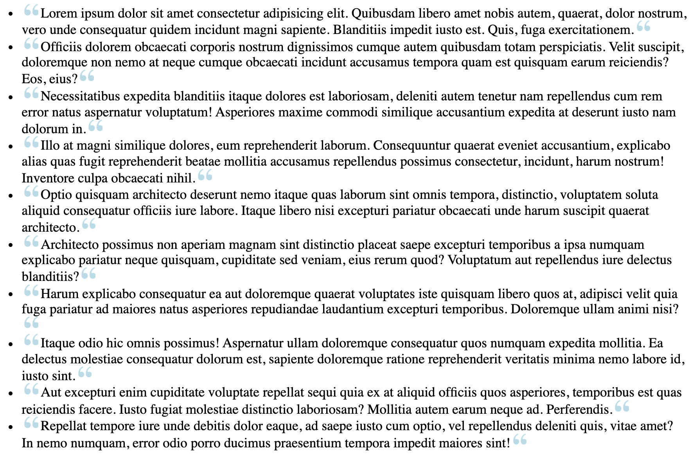

# Pseudo Element Style

### Teil 1

- Erstelle eine ungeordnete Liste von Lorem-ipsum-Zitaten mit emmet

- Pseudo-Elemente anwenden, um ein Zitat-Symbol vor und nach jedem Zitat zu platzieren

- Verwende diesen Link für das Quellbild - https://s3-us-west-2.amazonaws.com/s.cdpn.io/161359/quotes.png

#### Mockup

### Teil 2

Verwende Pseudo-Elemente, um das unten gezeigte Mockup nachzubauen.

- Nach jedem Dateieintrag wollen wir den entsprechenden Dateityp als Symbol anzeigen

- Verwende Attributselektoren, um Dateien nach Typ auszuwählen, und verwende dann ein Pseudo-Element, um das passende Dateisymbol hinter jedem Listeneintrag zu platzieren

#### Icons

> **PDF** - https://img.icons8.com/officel/64/000000/pdf.png
>
> **XLS** - https://img.icons8.com/dusk/64/000000/ms-excel.png
>
> **DOC** - https://img.icons8.com/dusk/64/000000/ms-word.png

### Teil 3

Erstelle mit den Pseudo-Elementen `::before` und `::after` das unten gezeigte 'sandwich div'.

- Diese Ränder sind keine ECHTEN Ränder - mach die Pseudoelemente zu Blockebenen mit Breite und Höhe und gib ihnen einen linearen Farbverlauf als Hintergrund

- Die oberen und unteren Farbverläufe sollten sich in der Richtung abwechseln
